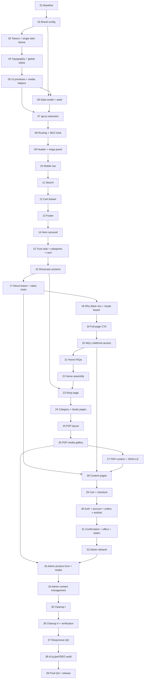

# LAMIKAA NATURALS rebuild — prompt programme index

This folder holds a sequential programme of **39 build prompts** that transform the Meghali's Silk storefront + admin (Create React App, JSON Server mock / Laravel API) into the LAMIKAA NATURALS storefront ("Luxury Skincare After Dark") while preserving every existing storefront and admin functionality and removing every trace of the old brand. The prompts were authored after a complete read-only analysis of the repository (see `_reference/REPO_MAP.md`); nothing in the application was changed in the authoring run.

## 1. How to use

1. Work on the branch `feat/lamikaa-naturals` (Prompt 01 creates it). Open a fresh Claude Code session per prompt.
2. Paste **one** prompt file at a time, in numerical order (`01_…` → `39_…`). Each prompt is self-sufficient given the reference files it names in its preamble.
3. The session must run the prompt's **Verification** section and satisfy every **Acceptance criterion** before moving on. If a criterion fails, re-run or continue the same prompt — never skip ahead.
4. Each prompt ends with a **Handoff**: update `PROGRESS.md` (status, date, commit, notes, decisions, open TODOs, placeholders), update the reference files it names, and commit with the conventional message.
5. Resuming after a break: read `PROGRESS.md` (the last `complete` row tells you the next prompt), `git log --oneline -5`, and `git status` (must be clean). If a prompt was left `in-progress`, finish it before starting the next.
6. Reference files (`_reference/*.md`) are the shared source of truth and are updated by the prompts that change a contract ("Updated by Prompt NN" notes). `PROGRESS.md` is the running log.

## 2. Global conventions

- **Branch / commits:** `feat/lamikaa-naturals`; one commit per prompt: `feat(lamikaa): NN <title>` (lower-case title as in the prompt file name, words separated by spaces).
- **Node / npm:** Node 18, 20 or 22 with `react-scripts@5.0.1`; `npm ci` once (Prompt 01). No new runtime dependencies are added by the programme (CLI tools only via `npx`).
- **Ports:** storefront `http://localhost:3000` (`npm start`), JSON Server `http://localhost:3001` (`npm run server`, via `server.js` with the safe DELETE); `npm run dev` runs both.
- **API modes:** `.env` → `REACT_APP_USE_MOCK_API=true` + `REACT_APP_API_URL=http://localhost:3001` = **mock mode (JSON Server over `db.json`)**; `REACT_APP_USE_MOCK_API=false` + `REACT_APP_API_URL=https://core.lamikanaturals.com/api/v1` = **live mode (Laravel API on Cloudways)**. Restart the dev server after changing `.env`. The Laravel backend is outside this repository: "both modes" means *exercised in mock mode and implemented/documented for the live branch*. Never run `npm run test:live` against production.
- **Build / tests:** `CI=true npm run build` (warnings are errors) and `npm test -- --watchAll=false` must pass at the end of every prompt.
- **Viewport checklist (every prompt with UI):** 360, 390, 414, 768, 1024, 1280, 1440 px; no horizontal scroll; keyboard walk; `prefers-reduced-motion: reduce`.
- **Global guardrails (repeated in every prompt):** preserve every existing storefront and admin functionality; no Meghali's Silk names/copy/assets/sample data/colours/fonts/identifiers introduced or left behind in touched files; no light/dark toggle, tokens are the only styling source, no hard-coded colours; every `db.json`/`api.js` change in both modes and reflected in the admin; mobile first, all breakpoints, WCAG AA, reduced motion; no new heavy dependencies; build clean, tests pass; no invented brand facts (placeholder tokens, logged); products and branding stay the focus, effects subtle.
- **Copy:** derived only from `_reference/BRAND.md` (+ copy rules 3.9), `PRODUCTS.md` and the packaging facts in `PACKAGING_NOTES.md`. Unknown facts are `{{TOKENS}}` (`PLACEHOLDERS.md`) that render harmlessly. Placeholder media are inventoried in `PLACEHOLDER_ASSETS.md`.

## 3. Adaptations to the brief

Repository realities that changed how the brief is implemented. Each is reflected in the relevant prompts.

1. **The two `api.js` modes are JSON Server (mock) and a live Laravel API** — there is no in-memory mock dataset. Parity therefore means: every new function has a mock branch (exercised) and a live branch (implemented and documented as an endpoint contract in `REPO_MAP.md` §3 for the backend team). (Prompt 07, 39.)
2. **Token names keep the repo's `--sf-*` prefix** (it means "storefront", not the brand; 100+ CSS modules consume tokens by name). The brief's `--lk-*` names are mapped one-to-one in `DESIGN_SYSTEM.md` §2; values change to the LAMIKAA palette; Meghali-era names (`--sf-color-emerald*`, `--sf-gradient-heritage`, `--brand-logo-bg`, `--sf-cat-*` …) are aliased in Prompt 03 and renamed/removed in Prompt 35.
3. **Product categories stay numeric ids**: `categoryId` (primary, existing consumers) plus a new `categoryIds[]`; the brief's `category`/`categories` slug fields are not stored (slugs are resolved from the `categories` collection). Category-by-slug is an API function. (Prompts 06, 07, 24.)
4. **Prices:** three MRPs are legible on the packaging (Face Wash ₹390, Goat Milk Soap ₹90, Scrub ₹349) and are seeded with `priceSource: "packaging-mrp"` (owner to confirm); the other five ship as `price: null, priceTBA: true` ("Price on launch", Add to Cart disabled) rather than string tokens inside numeric fields. Sizes and INCI lists for all eight products are legible and are seeded from the packaging. (`PACKAGING_NOTES.md`, `PLACEHOLDERS.md`, Prompts 05, 06.)
5. **The hero is product-driven** (`product.heroOrder`, `heroHeadline`, `heroSubtext`) instead of the admin-managed `banners` slides; the `banners` collection is repurposed as **`announcements`** (announcement bar) and the admin "Hero Section" screen becomes "Home & Hero" (hero product ordering + settings). (Prompts 06, 07, 14, 34.)
6. **Routes:** new canonical paths (`/shop`, `/category/:slug`, `/product/:slug`, `/rituals`, `/about`, `/why-lamikaa`, `/faq`, `/contact`, `/policies/*`, `/cart`, `/search`) with redirects from every old path (`/products`, `/products/:slug`, `/help`, `/support`, `/privacy`, `/terms`, `/refund`, `/cookies`, Meghali collection URLs). Auth stays modal-based; `/login` and `/register` open the modal. A `/cart` page and a `/search` page are added (the repo had a drawer-only cart and query-string search). `/special-offers` (admin-driven deals page) is kept. (Prompt 08, 11, 29, 31.)
7. **The shop has no filters, sort or pagination** — an explicit owner decision in the brief (§7.3) that replaces the existing catalogue UI; search remains through the overlay/results page. (Prompt 23.)
8. **`images[]` stays as a derived, always-synced mirror of `media[]`** so cart lines, wishlist snapshots, admin tables, search and the live test keep working; `normalizeProduct`/`syncProductMedia` keep the two in step in both modes. (Prompts 05, 07, 33.)
9. **Site content is markdown-lite blocks** rendered by a tiny in-repo parser (no CMS, no library), editable in a new admin "Content" screen. (Prompts 05, 06, 28, 34.)
10. **Typography and buttons:** Fraunces (display) + Manrope (UI) chosen after the packaging review; pill buttons system-wide. (Prompt 04.)
11. **Admin theme:** the admin shared the storefront's light/dark toggle, so it is removed everywhere; the admin settles on its own single dark LAMIKAA MUI theme (`buildAdminTheme("dark")`), isolated from storefront tokens. (Prompts 03, 32.)
12. **Reviews:** `rating`/`totalReviews` are 0 for every product; two sample reviews are flagged `isSample: true` and hidden by `brand.flags.showSampleReviews`; the admin's fabricated reviewer-name chips are removed. (Prompts 06, 07, 27, 32.)
13. **Home secondary sections:** "Recently viewed" (existing functionality) is retained; the home offers rail is removed because the deals page still exists; the old collection stories/edit/heritage/trending sections are deleted. (Prompt 22.)
14. **Free-shipping threshold:** the hard-coded `FREE_SHIPPING_THRESHOLD = 999` constant is retired; the meter/badge/announcement read live `shipping_methods.freeAbove` and hide when unknown. (Prompts 02, 12.)
15. **Placeholder rendering rules:** unresolved contact/social/GSTIN/hours rows are hidden; `{{…}}` never prints; tax is seeded as inclusive with rate 0 ("inclusive of all taxes", as printed "M.R.P incl. of all taxes"). Added tokens beyond the brief: `{{SUPPORT_HOURS}}`, `{{LAMIKAA_WHATSAPP_URL}}`, `{{TAX_RATE_PERCENT}}`, `{{JURISDICTION}}`, `{{REFUND_TIMELINE}}`. (`PLACEHOLDERS.md`.)
16. **Tests:** the repo has a single live-API test (skipped by default) and no unit tests; unit tests are added for the placeholder/cloudinary/product/search/contentBlocks utilities and a smoke test for the app. (Prompts 05, 11, 33, 39.)
17. **Live test mismatch:** `.env.production` already points at `https://core.lamikanaturals.com/api/v1` while `api.live.test.js` asserts the old host; fixed in Prompt 35.
18. **Mobile chrome:** the bottom nav hides on product pages (and the cart page if needed) so the sticky purchase bar never stacks on it. (Prompts 25, 29.)
19. **Non-functional UI removed:** the disabled Google/Facebook buttons in the auth modal. (Prompt 30.)
20. **Placeholder video hosts:** the brief's Google sample-bucket and w3schools URLs returned 403 from the analysis environment; MDN CC0 videos and Cloudinary demo videos are seeded instead (the brief's URLs are listed as alternates to verify on the developer's machine). (`PLACEHOLDER_ASSETS.md`, Prompt 06.)
21. **Temporary scaffolding** (`/_playground`, `ComingSoon` stubs, deprecated hero helpers, a temporary admin announcements tab) is introduced in Phase 0–1 and removed by Prompts 31, 34, 35.
22. **Certifications:** the packaging prints ISO / GMP / Non-GMO / Cruelty-Free roundels; they are seeded as `brand.packBadges` "as printed" and shown only in the PDP "As printed on the pack" block, pending owner confirmation.

## 4. Phases and ordered prompt table

| Phase | Prompts | Goal |
|---|---|---|
| 0 Foundations | 01–08 | Baseline, brand config, tokens/theme, typography, primitives, seed, API, routing |
| 1 Storefront shell | 09–13 | Header/mega panel, mobile nav, search, cart drawer, footer |
| 2 Home page | 14–22 | Hero, trust strip/categories/card, showcases, about, ingredient/rituals, CTA, why, FAQs, assembly |
| 3 Catalogue | 23–28 | Shop, categories/rituals, PDP ×3, content pages |
| 4 Commerce & account | 29–31 | Cart/checkout, auth/account/orders/wishlist, confirmation/offers/states |
| 5 Admin | 32–34 | Rebrand, product form + media manager, content management |
| 6 Cleanup & QA | 35–39 | Cleanup ×2, responsive QA, a11y/perf/SEO audit, final parity |

| # | File | Title | Phase | Depends on | Unlocks | Scope | Key files touched |
|---|---|---|---|---|---|---|---|
| 01 | `01_project-baseline-and-verification-harness.md` | Project baseline and verification harness | 0 | — | 02 | S | `.gitignore`, `PROGRESS.md` |
| 02 | `02_brand-config-module-and-identity-assets.md` | Brand config module and identity assets | 0 | 01 | 03, 06 | M | `src/config/brand.js`, `src/utils/{placeholders,cloudinary}.js`, `src/components/brand/Logo.js`, `src/utils/constants.js`, `public/*`, `package.json`, `.env*` |
| 03 | `03_design-tokens-and-single-dark-theme.md` | Design tokens and single dark theme | 0 | 02 | 04 | L | `src/theme/*`, `src/context/ThemeContext.js`, 21 mode consumers, 28 CSS modules, `public/index.html`, `AdminLayout.js`, `AdminLogin.js` |
| 04 | `04_typography-and-global-styles.md` | Typography and global styles | 0 | 03 | 05 | M | `public/index.html`, `storefront-tokens.css`, `storefront-primitives.css`, `index.css`, `App.css` |
| 05 | `05_shared-ui-primitives-and-media-helpers.md` | Shared UI primitives and media helpers | 0 | 04 | 06, 07, 09 | L | `src/components/ui/*`, `src/hooks/*`, `src/utils/{product,contentBlocks}.js`, `PriceBlock.js` |
| 06 | `06_data-model-and-seed.md` | Data model and seed (db.json) | 0 | 02, 05 | 07 | L | `db.json` |
| 07 | `07_api-contract-extension-in-both-modes.md` | api.js contract extension in both modes | 0 | 05, 06 | 08 | L | `src/services/api.js`, `src/utils/heroConfig.js`, shims |
| 08 | `08_routing-ia-lazy-loading-and-seo-hook.md` | Routing, IA, lazy loading and SEO hook | 0 | 07 | 09–13, 14, 23 | M | `src/App.js`, `src/hooks/useSeo.js`, `src/pages/NotFound/*`, `src/components/routing/*`, link sweep |
| 09 | `09_header-mega-panel-and-announcement-bar.md` | Header, mega panel and announcement bar | 1 | 08 | 10–14 | L | `src/components/Header/*`, `AnnouncementBar/*`, deletes `CategoriesDrawer/` |
| 10 | `10_mobile-navigation-drawer-and-bottom-nav.md` | Mobile navigation drawer and bottom nav | 1 | 09 | 11 | M | `SidebarMenu/*`, `BottomNav/*` |
| 11 | `11_search-overlay-and-search-results.md` | Search overlay and search results | 1 | 10 | 12 | M | `SearchModal/*`, `src/utils/search.js`, `src/pages/Search/*` |
| 12 | `12_cart-drawer-with-cross-sell.md` | Cart drawer with cross-sell | 1 | 11 | 13 | M | `CartDrawer/*`, `CartContext.js` |
| 13 | `13_footer.md` | Footer | 1 | 12 | 14 | M | `Footer/*`, `brand/LegalNote.js`, deletes `Newsletter/` |
| 14 | `14_home-hero-product-carousel.md` | Home hero product carousel | 2 | 13 | 15 | L | `src/components/home/HeroCarousel.js`, deletes `HeroSection/` |
| 15 | `15_trust-strip-and-shop-by-category-concern.md` | Trust strip, shop-by-category/concern and product card | 2 | 14 | 16 | M | `TrustStrip/*`, `home/ShopByCategory.js`, `catalogue/CategoryCard.js`, `storefront/ProductCard.*` |
| 16 | `16_home-product-showcase-sections.md` | Home product showcase sections | 2 | 15 | 17, 23 | L | `catalogue/ProductChapter.js`, `home/ProductShowcase.js` |
| 17 | `17_about-lamikaa-section-and-value-chain-visual.md` | About LAMIKAA section and value-chain visual | 2 | 16 | 18, 28 | M | `brand/ValueChain.js`, `home/AboutTeaser.js` |
| 18 | `18_why-black-rice-spotlight-and-rituals-teaser.md` | Why Black Rice spotlight and rituals teaser | 2 | 17 | 19 | M | `home/WhyBlackRice.js`, `home/RitualsTeaser.js`, `catalogue/RitualCard.js` |
| 19 | `19_full-page-cta-section.md` | Full-page CTA section | 2 | 18 | 20 | S | `home/FullPageCta.js`, `brand/NewsletterForm.js` |
| 20 | `20_why-lamikaa-section-pillars-and-impact.md` | Why LAMIKAA section (pillars and impact) | 2 | 19 | 21, 28 | M | `brand/Pillars.js`, `brand/ImpactTriptych.js`, `home/WhyLamikaaSection.js` |
| 21 | `21_home-faqs-section-and-accordion.md` | Home FAQs section and accordion | 2 | 20 | 22 | S | `FAQ/*`, `home/HomeFaqs.js` |
| 22 | `22_home-assembly-performance-and-seo.md` | Home assembly, performance and SEO | 2 | 21 | 23 | M | `src/pages/Home/*`, deletes `FeaturedProducts/`, `CTASection/` |
| 23 | `23_shop-page-chaptered-editorial-listing.md` | Shop page: chaptered editorial listing | 3 | 16, 22 | 24 | L | `src/pages/Shop/*`, `catalogue/ChapterIndex.js`, deletes `pages/Products/` |
| 24 | `24_category-pages-and-rituals-pages.md` | Category pages and rituals pages | 3 | 23 | 25 | M | `pages/Shop`, `pages/Rituals/*`, `catalogue/RitualStep.js` |
| 25 | `25_pdp-layout-chapters-purchase-panel-and-mobile-bar.md` | PDP: layout, chapters, purchase panel and mobile bar | 3 | 24 | 26 | L | `pages/ProductDetails/*`, `pdp/PurchasePanel.js`, `pdp/ChapterNav.js`, `AddToCartBar.*` |
| 26 | `26_pdp-media-gallery-with-images-and-videos.md` | PDP: media gallery with images and videos | 3 | 25 | 27, 33 | L | `pdp/MediaGallery.js`, `pdp/Lightbox.js`, deletes `ProductGallery.*` |
| 27 | `27_pdp-supporting-content-reviews-cross-sell-and-json-ld.md` | PDP: supporting content, reviews, cross-sell and JSON-LD | 3 | 26 | 28 | M | `pdp/*`, `src/utils/seo.js`, `ReviewsSection.*`, `FrequentlyBoughtTogether.*`, `RelatedProducts.*` |
| 28 | `28_content-pages-from-sitecontent.md` | Content pages from siteContent | 3 | 17, 20, 27 | 29 | L | `pages/About`, `WhyLamikaa`, `Faq`, `Contact`, `Policies`; deletes 7 old page folders |
| 29 | `29_cart-page-and-checkout-restyle.md` | Cart page and checkout restyle | 4 | 28 | 30 | L | `pages/Cart/*`, `pages/Checkout/*` |
| 30 | `30_auth-account-orders-and-wishlist-restyle.md` | Auth, account, orders and wishlist restyle | 4 | 29 | 31 | L | `AuthModal/*`, `ReviewModal/*`, `pages/Profile/*`, `pages/OrderHistory/*`, `pages/Wishlist/*`, `src/utils/orderStatus.js` |
| 31 | `31_order-confirmation-offers-search-and-state-consistency.md` | Order confirmation, offers, search and state consistency | 4 | 30 | 32 | M | `pages/OrderConfirmation/*`, `pages/SpecialOffers/*`, `ui/EmptyState.js`, deletes `_ComingSoon/` |
| 32 | `32_admin-rebrand-and-shell.md` | Admin rebrand and shell | 5 | 31 | 33 | M | `src/theme/adminTheme.js`, `AdminLayout.js`, `pages/Admin/*` |
| 33 | `33_admin-product-form-media-manager-and-new-fields.md` | Admin product form: media manager and new fields | 5 | 26, 32 | 34 | L | `pages/Admin/AdminProducts.js`, `pages/Admin/components/*` |
| 34 | `34_admin-content-management.md` | Admin content management | 5 | 33 | 35 | L | `pages/Admin/{AdminHeroSection,AdminRituals,AdminContent,AdminAnnouncements,AdminConcerns,AdminCategories,AdminFaqs,AdminDashboard,AdminSettings}.js`, `AdminLayout.js`, `App.js` |
| 35 | `35_brand-cleanup-1-code-identifiers.md` | Brand cleanup I: code identifiers | 6 | 34 | 36 | M | tokens, identifiers, comments, tests, dead files |
| 36 | `36_brand-cleanup-2-content-assets-seeds-and-verification.md` | Brand cleanup II: content, assets, seeds and verification | 6 | 35 | 37 | M | `db.json`, `public/*`, `package*.json`, `README.md`, `.env*`, greps |
| 37 | `37_responsive-and-mobile-qa-pass.md` | Responsive and mobile QA pass | 6 | 36 | 38 | M | `_reference/QA_MATRIX.md`, fix-ups |
| 38 | `38_accessibility-performance-and-seo-audit.md` | Accessibility, performance and SEO audit | 6 | 37 | 39 | M | `_reference/AUDIT.md`, `scripts/generate-sitemap.js`, fix-ups |
| 39 | `39_final-qa-parity-readme-and-release-notes.md` | Final QA, parity, README and release notes | 6 | 38 | — | L | `README.md`, `RELEASE_NOTES.md`, `scripts/placeholder-inventory.js`, tests, inventories |

## 5. Dependency graph

## 6. Requirements coverage matrix (Appendix A of the brief)

| ID | Requirement (short) | Covered by |
|---|---|---|
| R01 | Repository analysed; findings in `REPO_MAP.md` | Authoring run (Phase A) → `_reference/REPO_MAP.md`; re-verified by 01 |
| R02 | 30–40 prompts + `00_INDEX.md`; nothing outside `prompts/` modified | Authoring run (this file + 39 prompts); Phase C self-review |
| R03 | Complete rebrand with dedicated cleanup prompts + zero-result grep (source + build) | 02, 35, 36, 39 |
| R04 | Eight products seeded with the exact Cloudinary cover URLs as primary media | 06 (crop verification 16) |
| R05 | Packaging/logo/icon downloaded and reviewed; palette/typography/copy grounded | Authoring run → `PACKAGING_NOTES.md`; 02, 04, 14, 16 |
| R06 | Brand story/philosophy/motive/impact/difference/vision integrated with legal qualifiers | 02, 06, 13, 17, 20, 27, 28 |
| R07 | Seven categories as data and routes; Why LAMIKAA page + nav item | 06, 08, 09, 23, 24, 28 |
| R08 | Home hero: one slide per product, headline + subtext, two CTAs, autoplay/swipe/keys/a11y | 14 |
| R09 | One full editorial section per product with badges and CTAs | 16 |
| R10 | Home continues with About, full-page CTA, Why LAMIKAA, FAQs, footer (+ justified secondary sections) | 13, 17, 19, 20, 21, 22 |
| R11 | Storefront recognisably different (navigation, composition, space) | 09, 10, 14, 16, 22, 23, 25, 39 (before/after) |
| R12 | Listing page without filters; prominent full sections; category pages constrain by route | 23, 24 |
| R13 | PDP rebuilt, innovative, minimal, complete | 25, 26, 27 |
| R14 | PDP media gallery with images and videos (thumbs, inline player, lightbox, swipe, keyboard) | 26 |
| R15 | Admin manages image links and video links (add/remove/reorder/preview) in both modes | 07, 33 |
| R16 | Light/dark switching removed; single dark theme; admin isolated | 03, 32 |
| R17 | Exact palette and visual balance | 03, 04, 38 |
| R18 | Tasteful ambient glow | 04, 05, 14, 15, 16, 19 |
| R19 | Glassmorphism per recipe with fallbacks and readability | 04, 05, 09, 10, 11, 12, 15, 19 |
| R20 | Signature gradient token, used sparingly | 03, 04 |
| R21 | "Luxury Skincare After Dark" without excess | 03, 04, 22, 38 |
| R22 | Every existing storefront functionality preserved | 12, 29, 30, 31, 39 (+ per-prompt guardrails) |
| R23 | Admin fully functional and rebranded; Meghali fields removed | 32, 33, 34, 39 |
| R24 | Fully responsive, mobile first, verified at the breakpoints | 37 (+ every UI prompt's QA) |
| R25 | Logo/icon URLs used everywhere, centralised in brand config | 02 |
| R26 | Open-source placeholder media with a maintained inventory | 06, 39 (`PLACEHOLDER_ASSETS.md`) |
| R27 | `api.js` dual-mode contract preserved/extended; `db.json` updated; JSON Server clean | 06, 07, 39 |
| R28 | `src/theme/*` single styling source, extended with glass/glow/gradient/focus tokens | 03, 04, 35 |
| R29 | WCAG 2.1 AA, keyboard-complete, reduced motion | 05, 38 (+ every UI prompt) |
| R30 | Performance practices and Lighthouse targets | 14, 22, 38 |
| R31 | SEO: meta/OG, JSON-LD, manifest/favicons/robots/canonicals | 02, 08, 22, 27, 28, 38 |
| R32 | Rituals content and pages | 06, 18, 24, 34 |
| R33 | Site-level and per-product FAQs data-driven and manageable | 06, 21, 27, 28, 34 |
| R34 | No fabricated facts/social proof; placeholders tokenised and logged; sample reviews flagged/hidden | 02, 06, 27, 32, 39 |
| R35 | Every prompt grounded in real files, mandatory template, verification, `PROGRESS.md` handoff | All 39 prompts (Phase C check) |
| R36 | Final QA and parity prompt(s) with README and release notes | 39 (with 37, 38) |

Merged/split notes: the brief's suggested "15 Trust strip + Shop by category/concern" also absorbs the shared `ProductCard` rebuild (it is needed by search/wishlist/related before the showcase); "11 Search overlay" also delivers the `/search` results page (same domain); "31" covers order confirmation, the offers page and the shared empty/error/loading/404 states; "34" covers categories/rituals/concerns/FAQ groups/site content/announcements/home-hero admin in one prompt because they share the editors built in 33.

## 7. Programme Definition of Done

- Every requirement R01–R36 satisfied per the matrix above and ticked in `PROGRESS.md` by Prompt 39.
- The cleanup greps (Prompt 36, source and `build/`) return zero; `BRAND_FOOTPRINT.md` fully ticked with the verification commit.
- Both api modes verified: mock mode end-to-end (storefront + admin) and the live branch reviewed against the endpoint contract in `REPO_MAP.md` §3 (backend hand-off section present).
- Lighthouse mobile targets met on `/`, `/shop`, a PDP and `/checkout` (`AUDIT.md`); axe clean; keyboard flows complete; reduced motion respected.
- Placeholder inventories (`PLACEHOLDERS.md`, `PLACEHOLDER_ASSETS.md`) regenerated and current; no `{{…}}` renders anywhere.
- `CI=true npm run build` clean; `npm test -- --watchAll=false` green; `git status` clean on `feat/lamikaa-naturals`; README and release notes committed.
- The `prompts/` folder may then be deleted or archived outside the repository by the developer; git history is out of scope.
